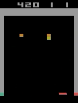

# A Solution For DQN
A DQN Solution can easily reach high score for Atari Breakout game.

If you feel this repository helpful, please leave a star ⭐, thanks.

🎯 Key Idea: Improving Score with 5 Replay Buffers (⚠️⚠️⚠️ This trick can help you improve score from 300+ to 400+. You should get a score close to 300 with standard implementation. You can do an ablation study to see how much does this trick contribute.)

In standard DQN implementations, the replay buffer often becomes biased toward experiences from the later stages of the game (e.g., when only a few bricks remain). As the agent masters these later stages, it can gradually “forget” how to play the early stages — and vice versa.
This imbalance can lead to skewed optimization, where updates mainly reflect whichever stage dominates the replay buffer.

To mitigate this, I introduce a multi-buffer replay system:

1. Maintain 5 separate replay buffers, each corresponding to a specific life (difficulty level).

2. During training, sample evenly from all 5 buffers and merge the samples into a single batch.

This ensures that every training update considers experiences from all stages of the game. By balancing training data across difficulty levels, the optimization remains unbiased, improving overall stability and performance.

I trained on a machine with Intel Core i5-13500, 32GB RAM and a single NVIDIA 4060Ti GPU (CPU is more important here, since the neural network is not very huge and sample speed is more crucial for collecting experience used for updating). It can reach 250 score after training for around 30 mins and reach 350 after training for 1 hour. Finally, I got 490.



If you want to train from begining, use commands below:

Create environment:

```bash
conda env create -f environment.yml
conda activate breakout_solution
```
Start training (you need to modify some saving path to your machine)
```bash
python ./main.py --train_dqn
```
I also uploaded my model parameters(tested_490.37_482.3_episode_6300.ckpt), to test it, use:
```bash
python ./main.py --test_dqn
```

🚨 I listed Common DQN Pitfalls, you can check your implementation with these caveats:

⚠️ Caveat1: Correct Handling of Terminal States in the Bootstrap Target

When using bootstrap formula, remember to distinguish whether s_t+1 is a terminal state or not:

y_t = r_t + gamma*max(s_t+1, a_t), when s_t+1 is NOT a terminal state

y_t = r_t, when s_t+1 is a terminal state

⚠️ Caveat2: Use a Target Network

Maintain a target Q-network to compute the max_a Q(s_{t+1}, a) term, and update the target network periodically (e.g., every 5,000 steps).

⚠️ Caveat3: Exploration Decay Strategy

For Breakout, a fast decay works surprisingly well:

Start with ε = 1.0

Decay to ε = 0.1

Reduce by 0.9 / 1,000,000 after each experience tuple is added to the replay buffer.

Although this decay sounds extremely quick, it is appropriate for this game.
